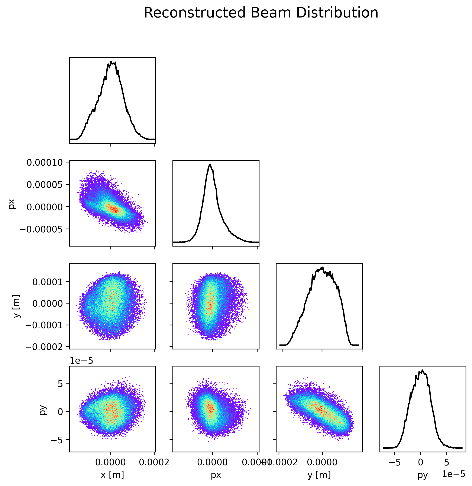
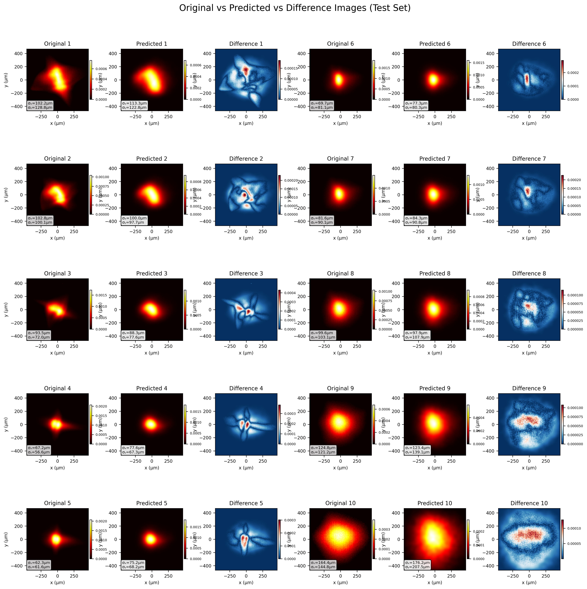

# Phase Space Reconstruction

## Overview
This repository contains tools and implementations for reconstructing phase space distributions of particle beams. It leverages neural networks, GPU-accelerated simulations, and advanced image processing techniques to analyze and compare beam dynamics.

## Contents
- **Core Modules**: 
  - `core/beam_generator.py`: Neural network-based beam generation.
  - `core/simulation.py`: GPU-accelerated screen image generation.
  - `core/train.py`: Training pipeline for beam reconstruction models.
  - `core/results.py`: Saving and visualizing results.
  - `core/dataloader.py`: Custom dataset and dataloader for beam images.
  - `core/image_processing.py`: Image preprocessing utilities.
  - `core/losses.py`: Loss functions for training.

- **Utilities**:
  - `utils/visualization.py`: Functions for visualizing beam images and projections.

- **Scripts**:
  - `main.py`: Main script for training and evaluating beam reconstruction models.
  - `start.sh`: Bash script for setting up the environment and running the main script.
  - `compare_results.py`: Script for comparing results between different beam models.

- **Notebooks**:
  - `test_differential_simulation.ipynb`: For simulating differential beam images.
  - `implementation_emittance.ipynb`: For calculating emittance and analyzing beam properties.
  - `train_with_new_simulation.ipynb`: Training steps broken down into small components for more customization.

## Usage
### Running `main.py`
The `main.py` script is the primary entry point for training and evaluating beam reconstruction models. It processes datasets, trains the model, and saves results to the `logs/beam_training` directory.

#### Command-Line Arguments
- `--version`: Specify the version for logging. If not provided, the script will automatically determine the next version.
- `--dataset`: Specify the dataset to use (1 or 2).

#### Example Usage
1. Run the script with dataset 1 and automatically determine the version:
   ```bash
   python main.py --dataset 1
   ```

2. Run the script with dataset 1 and specify version 0:
   ```bash
   python main.py --version 0 --dataset 1
   ```

3. Run the script with dataset 2:
   ```bash
   python main.py --dataset 2
   ```

### Output
- Results are saved in the `logs/beam_training/version_X` directory, where `X` is the version number.
- Key outputs include:
  - Reconstructed beam distribution plots.
  - Test image comparisons (original vs predicted).
  - Emittance results and error analysis.

### Advanced Analysis
- Use `test_differential_simulation.ipynb` for simulating differential images.
- Use `implementation_emittance.ipynb` for detailed emittance calculations.

### Comparing Results
- Use `compare_results.py` to compare results between different beam models. This script generates comparison plots for sigma and RMS values.

#### Example Usage
1. Compare a single model:
      ```bash
      python compare_results.py --dataset 2 --v1 62 --crop_size 160
      ```

   2. Compare two models:
      ```bash
      python compare_results.py --dataset 2 --v1 62 --v2 63 --crop_size 160
      ```

### Visualization
- View reconstructed beam distributions and test image comparisons in the results directory.

## Example Results
### Reconstructed Beam Distribution
This plot shows the reconstructed phase space obtained by training model on an experimental data:


### Test Images Comparison
This plot compares the original, predicted, and difference images for the test set from the experimental data used for above reconstructed beam:


## Getting Started
1. Clone the repository:
   ```bash
   git clone /afs/psi.ch/intranet/SF/Beamdynamics/Harsh/ps_reconstruction
   cd ps_reconstruction
   ```

2. Run the main script:
   ```bash
   bash start.sh
   ```

## Notes
- Ensure the dataset paths in `main.py` are correctly configured.
- For large datasets, adjust batch sizes in `train.py` and `dataloader.py` to optimize memory usage.
- Results are saved in structured directories under `logs/beam_training`.